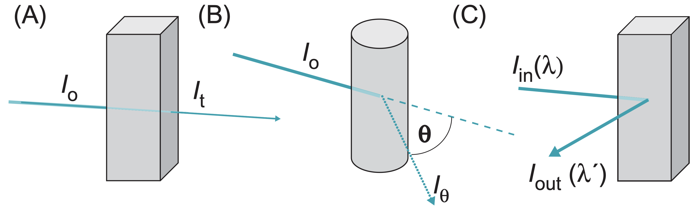

(ref:p1) Structure and Function of Macromolecules

```{r echo=FALSE, results="asis"}
if(knitr::is_latex_output()){
  cat("# (PART) (ref:p1) {-} ")
} else {
  cat("# (PART) Structure and Function of Macromolecules {-} ")
}
```

# Paper I: Structure and Function of Macromolecules {#p1}

# Physical Methods {#physical-methods}

Course aims:
 
- This course of 10 lectures introduces the principles and applications of biophysical tools that give information about the structure, dynamics and interactions of biological molecules, primarily in vitro but also in vivo. 
 
- The techniques we describe mainly involve irradiating the specimen with electromagnetic radiation. They include: scattering (e.g. SAXS, SANS, DLS); refraction related phenomena (e.g. SPR); X-ray diffraction/crystallography; absorption and emission spectra (e.g. UV/visible, CD, fluorescence); magnetic resonance (NMR & MRI); microscopy and experiments on single molecules (single pair FRET, optical ‘tweezers’ etc.). Other important biophysical methods, such as analytical ultracentrifugation, calorimetry and mass spectrometry, will be covered in other lecture courses.
 
- In general, physical methods can have relatively difficult associated concepts. You should realise that this course is an introduction to the methodology. By the end of the course you should understand something about the physical basis of the various methods discussed, how they are applied, and what information they can provide. The goal is that you will be able to get the gist of a paper in a scientific publication that uses one or more of these methods. This means that you should know the implications of some of the jargon used; e.g. "data collected to 2.8Å resolution" in an X-ray diffraction paper.
 
Sources of help:
 
- All the Powerpoint lectures will be available on Weblearn and there is also a supplement there with useful Web-sites and links to relevant scientific papers (accessible through Oxford University on-line e-Journals).
 
- Basic textbooks, e.g. Alberts et al., cover some aspects of biophysical methods. However, some more specific books that describe biophysical techniques are recommended; e.g.:
    - Campbell ID, Biophysical techniques. OUP, 2012.
    - Branden and Tooze, Introduction to Protein Structure. Freeman (2nd edn.), 1998.
    - Hammes G, Spectroscopy for the biological sciences. Wiley, 2005.
    - Sheehan D, Physical Biochemistry. Wiley (2nd edn) 2009.
    - Van Holde, Johnson & Ho Principles of Physical Biochemistry, Prentice Hall (2nd edn), 2005. 
    
## Electromagnetic Radiation

### Interaction of EM Radiation with Matter

- scattering
  - reflection and refreaction can be explained by scattering
  - scattering from ordered arrays gives interpretable diffraction patterns
- Trnsitionss between molecular energy levels
  - absorption and emission 
- light-induced chemical events

### Scattering

Indident electromagnetic radiation causes a particle to oscillate. The oscillations give rise to secondary radiation, which can give information about the concentration, shape, and motion of the scattering particle. The 3 main classes of scattering experiment are shown in Fig. \@ref(fig:scattering-experiments-overview)

(ref:scattering-experiments-overview-cap) Some classes of scattering experiment, which measures (A) the reduction in transmitted intensity (turbidity); (B) the angular dependence of the scattering radiation (_I_ as a function of $\theta$); (C) changes in $\lambda$ (or $\nu$), measured at a fixed angle (usually 90$^\circ$C) to the incident beam

```{r scattering-experiments-overview, echo=FALSE, fig.cap="(ref:scattering-experiments-overview-cap)", out.width="100%"}

```


