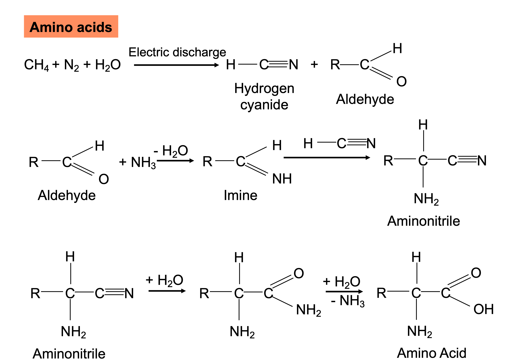
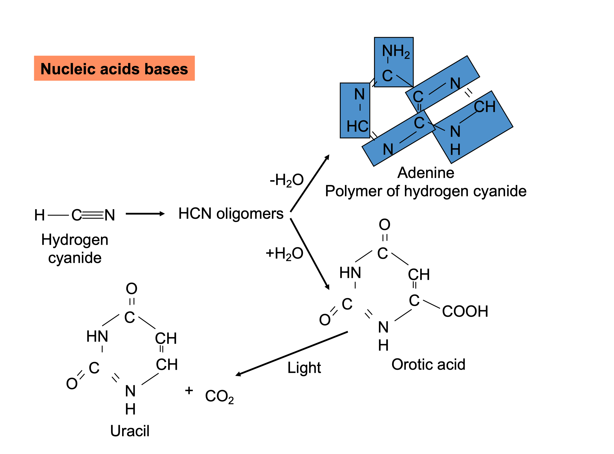
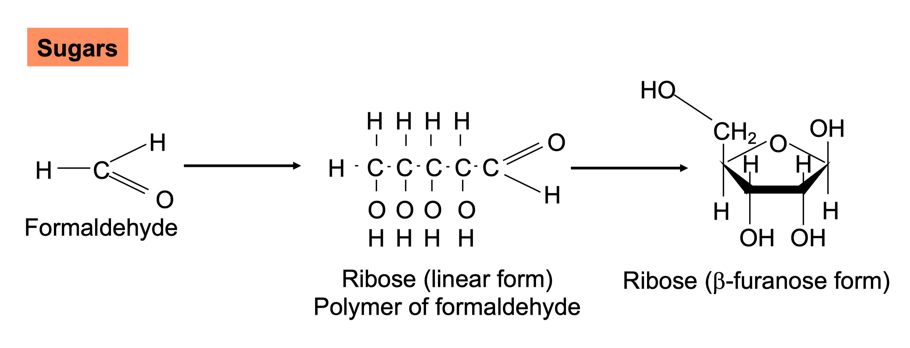
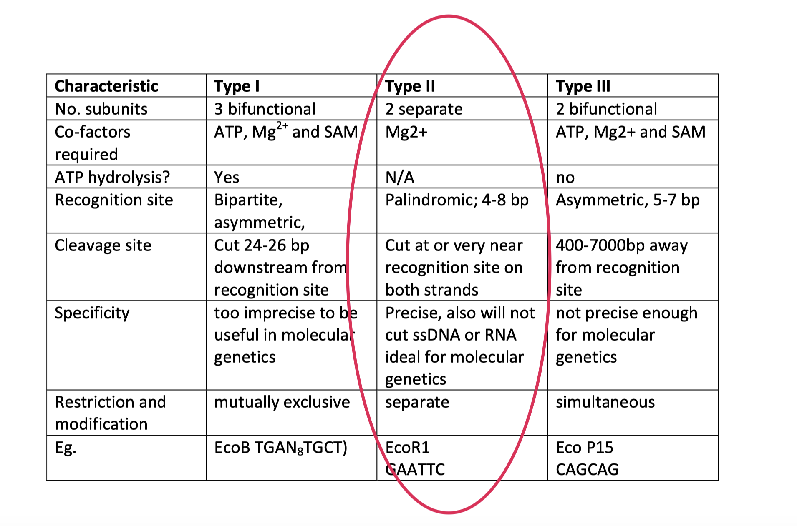
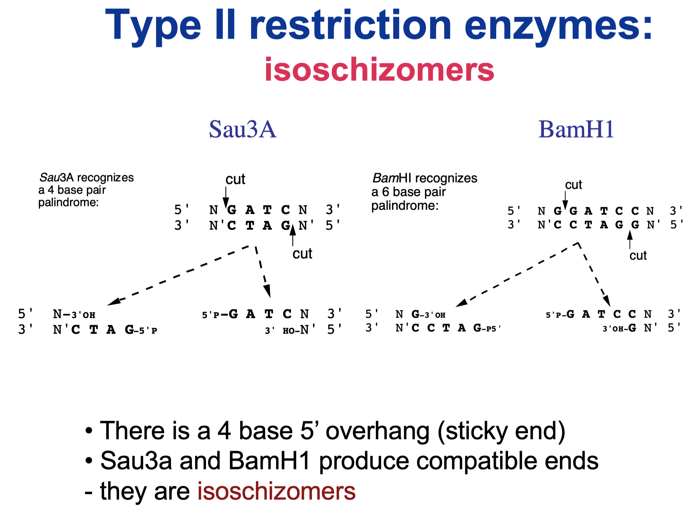
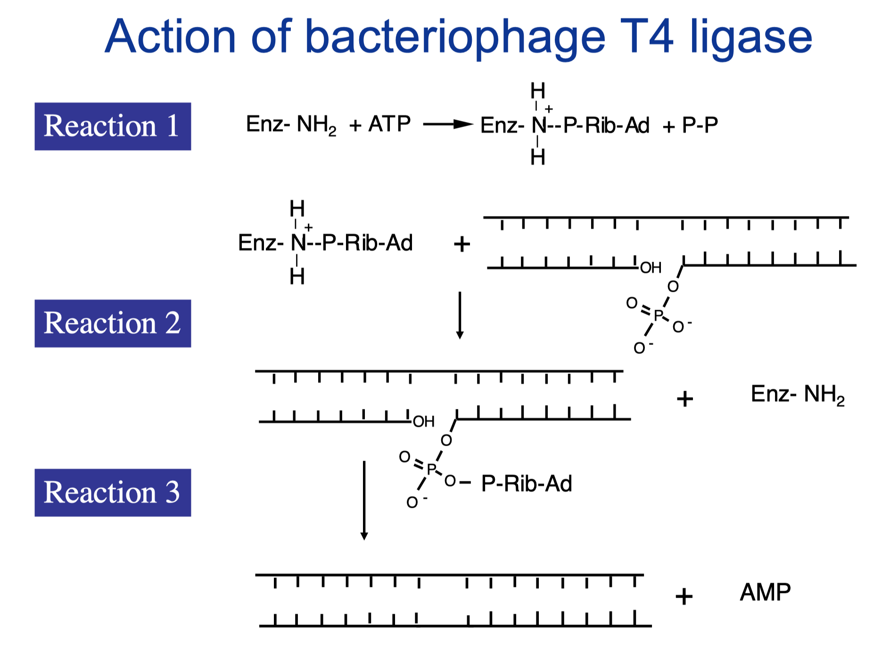
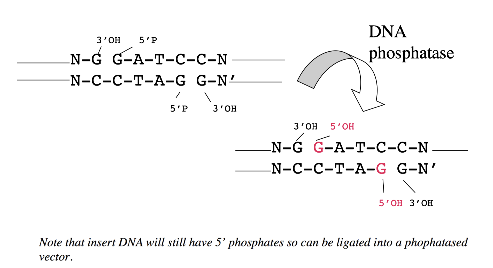
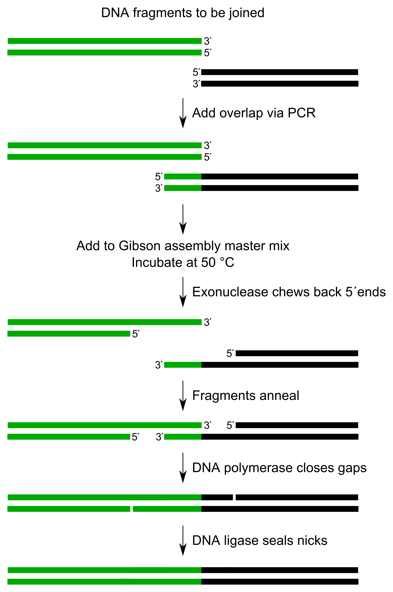
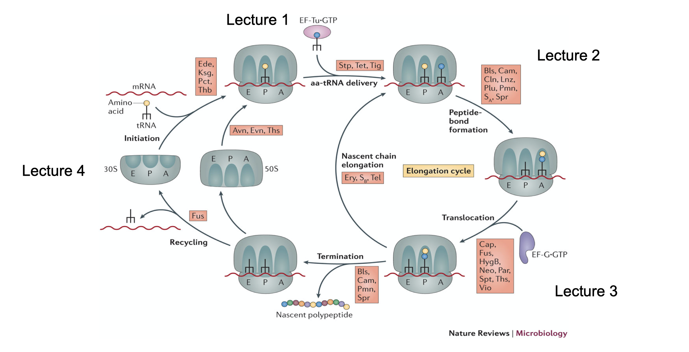

(ref:p3) Genetics and Molecular Biology

```{r echo=FALSE, results="asis"}
if(knitr::is_latex_output()){
  cat("# (PART) (ref:p3) {-} ")
} else {
  cat("# (PART) Genetics and Molecular Biology {-} ")
}
```


# An Introduction to Paper III: Genetics and Molecular Biology {#p3}

This is an intro to paper III

# Molecular Biology and Genetics

# Evolution of Genes and Genomes

## The Origins of Life (Abiogenesis)

Abiogenesis is the process by which life has arisen from non-living matter, such as sinple organic compounds.

The transition from non-living to living entities was not a single event, but an evolutionary process of increasing complexity that involved:

- molecular self-replication (RNA introns and Qβ phage)
- self-assembly (no enzymes)
- autocatalysis (RNA enzymes and self-splicing RNA)
- emergence of cell membranes

Assumption: all life forms descended from a single ancestral life from or progenote. Evidence:

- many essemtial building blocks of life could have assembled spontaneously from chemicals present on primitive Earth (prebiotic synthesis)
- paleobiologists show that the first fossil cells (microfossils) evolved from the prebiotically synthesised building blocks of life about 3-4 mya, when Earth was about 1-1.5 b yo
- based on analyses of meteorites, some components of RNA may have formed in space and arrived on Earth
- Molecular Fossils are structures (e.g. the placement of introns within a gene) or functions (e.g. the use of a particualr metabolic pathway or the composition of a membrane or the information processing systems) that are shared by such diverse organisms that they must have been present in the first cells, as well as in earlier pre-cellular forms of life.
- the rate at which genome sequences are being obtained means rapid process is being made in understanding evolution of modern organisms

## The Miller-Urey Experiments (1952)

- A chemical experiment that simulated the conditions thought to be present on the early earth and tested the chemical origin of life under those conditions (water, methane, ammonia, hydrogen, spark)
- well over 20 different amino acids produced; more than the 20 that naturally occur
- recent evidence suggests that Earth's original atmosphere might have had a composition different form the gas used in Miller experiment, but prebiotic experiments continue to peoduce racemic mixtures of simple to complex compounds under varying conditions

```{r prebiotic-synthesis-amino-acid, echo=FALSE, fig.cap="Prebiotic synthesis of amino acid"}

```

```{r prebiotic-synthesis-bases, echo=FALSE, fig.cap="Prebiotic synthesis of bases"}

```

```{r prebiotic-synthesis-sugars, echo=FALSE, fig.cap="Prebiotic synthesis of sugars"}

```

- These pathways are hightly speculative
- These reactions could only have taken place in a reducing or non-reducing atmosphere but not in the modern strongly oxidising atmosphere
- Amino acids and other building blocks of life are regularly found buried deep in meteorites from elsewhere in the solar system

## RNA World Hypothesis

Why RNA not DNA?

- enzymatic activity
  - No enzymatic activity has ever been attributed to DNA
  - RNA has a 2'OH and has the ability to fold into complex 3d structures (e.g. tRNA, rRNA) essential to create an active site for catalysis
  - the 2'OH of ribose plays a direct catalytic tole in many ribozymes
  - very short RNAs can be catalytic i.e. 52 nucleotides of RNA from a plant virus has catalytic activity (essential if this ability evolved from the primordial soup)
- Although all cells have DNA genomes, DNA precursors (deoxyribonucleotides) are always synthesised from RNA precursors (ribonucleotides) using **ribonucleoside diphosphate reductase**
- reverse transcriptase could have copied RNA into DNA


## Self-splicing intron of *Tetrahymena*

# Molecular Biology Toolbox

## Recombinant DNA

Techniques that allow the **isolation, manipulation, amplification, and expression** of identifiable sequences of DNA.

## RE- and ligation-dependent methods

Restriction enzymes serve as bacterial immune response against phages and foreign DNA. They recognise specific DNA sequences and cleave the DNA in a Mg^2+^-dependent manner, acting as molecular "scissors". Type II RE is commonly used in lab.

```{r types-of-re, echo=FALSE, fig.cap="Types of restriction enzymes."}

```

```{r isoschizomers, echo=FALSE, fig.cap="REs which produce compatible ends are called isoschizomers. In this case, both have the 4 base 5' overhang GATC"}

```

Bacteria protect their own DNA from cleavage by methylating A.

Bacteriophage T4 ligase is used to ligate GOI with the vector

```{r t4-ligase-action, echo=FALSE, fig.cap="Action of T4 ligase."}

```

```{r prevent-self-ligation, echo=FALSE, fig.cap="Preventing self-ligation"}

```

Blunt end methods:

- removal of overhang: S1 nuclease
- (or) filling in an overhang: Klenow fragment + dNTPs + Mg^2+^
- Blunt end ligation: DNA ligase

## Other Applications of RE

Restriction fragment length polymorphism (RFLP) is a molecular method of genetic analysis that allows individuals to be identifed based on unique patterns of restriction enzyme cutting in specific regions of DNA. 

## Alternatives to RE- and ligase-based cloning

```{r gibson-cloning, echo=FALSE, fig.cap="Gibson cloning. Gibson assembly is a molecular cloning method which allows for the joining of multiple DNA fragments in a single, isothermal reaction. The PCR products do not need to be digested. The method can simultaneously combine up to 15 DNA fragments based on sequence identity. It requires that the DNA fragments contain ~20-40 base pair overlap with adjacent DNA fragments. "}

```

Gateway cloning (via homologous recombination): the Gateway cloning system exploits the site-specific recombination system utilized by bacteriophage lambda to shuttle sequences between plasmids bearing flanking compatible recombination attachment (att) sites

TOPO cloning (uses topoisomerase I to hold vectors open and to promote ligation); expoits Taq polymerase's feature that adds non-specific A to the 3' end

# The Mechanism of Protein Synthesis: The Ribosome

Overview

- charging tRNAs: maintaining accuracy
- the structure of the 70S ribosome and the 30S and 50S subunits
- the factors involved in the initiation, elongation and termination of translation
- maintaining the fidelity of translation (decoding)
- the peptidyl transferase reaction

## Antibiotics inhibit translation

```{r translation-antibiotics, echo=FALSE, fig.cap="Antibiotics inhibit different steps of translation"}

```

## Aminoacyl-tRNA synthesis

## tRNA structure

- With one exception (initiator tRNA) all aminoacyl-tRNAs interact with the ribosome and with elongation factors in the same way, so they must all have features in common:
  - cloverleaf-shaped secondary structure; stems with Watson-Crick base paring and 3 loops (D loop, psi loop and the anticodon loop); modified nucleotides; CCA3' terminal group in the acceptor stem
  - L-shaped tertiary structure; 3D structure contains non-Watson-Crick base pairs and intercalated bases ('base stacking')
  - rRNAs and tRNAs are heavily stacked and show triple base interactions in which a base (usually A/G) forms an interaction in the minor groove of a Watson-Crick-base pair.
- conserved nucleotides maintain the shape but at the same time all tRNs must be able to be distinguished for binding to different amino acids by the cognate amino acyl tRNA synthetases

Processing tRNAs:

- RNAP III; processing of primary transcripts in nucleoplasm
- 5' end sequence is removed by RNase P; CCA is added to the 3' end; multiple internal bases are modified (methylated A, C, G, T=U); pseudouridine, dihydrouridine

## Mischarging: the accuracy of matching amino acids to tRNAs

- mutations that lead to mis-charging (an amino acid being linked to the wrong tRNA) can be in the anticodon, the D loop or in the acceptor stem of the tRNA, suggesting that the synthetase inspects the whole conformation of the tRNA as well as details of base recognition
- the presence of modified nucleotides (with the potential for unusual interactions) suggests also that local details of shape are important for recognition
- the frequency of missense errors can be determined by the rate of incorporation of amino acids into protein in which it is not encoded (e.g. cysteine in flagellin)
- frequency ~ 10^-4^ as the overall rate of error of mis-incorporation
- therefore the two recognition steps in protein synthesis (matching amino acids to tRNAs and matching tRNAs to codons on the mRNA) must each have an error frequency no worse than 10^-4^

- recognition of the amino acid by aa-tRNA synthetase must involve non-covalent interactions between amino acids and enzyme
- however, the difference between some amino acids is only a single methyl group (e.g. I/V; S/T; A/G). One methyl group contributes very little to the binding energy and would allow discrimination only to an error level of 10^-2^
- the recognition system therefore need two steps of discrimination independently, involving two separate attempts by the enzyme to recognise the amino acids
- the make the error frequency multiplicative, these must be separated by an irreversible (energy-requiring) step (hydrolysis of ATP)
- there are two different ways of achieving these two separate attempts at recognition: 'pre-transfer editing' and 'post-transfer editing' (hydrolytic editing)

An example with the isoleucine tRNA synthetase:

- the first attemp at recognition is by the original choice of amino acid. The binding of Ile and formation of Ile-adenylate is only 10^2^ better than binding of Val and formation of Val-adenylate
- the second step: the valyl-adenylate is hydrolysed by the enzyme much more rapidly than isoleucyl-adenylate — and does not proceed to tRNA reaction — so total discrimination if 10^4^

A second example of hydrolytic editing occurs at a second active site on the synthetase and is illustrated by valyl-tRNA synthetase.

The initial recognition of valine does not discriminate well against threonine, and after the formation of valyl/theonyl adenylate and then the aa tRNA, threonyl-tRNA is hydrolysed 3000 times faster than valyl-tRNA at a separate site on the enzyme. Also, in the presence of tRNA^Ile^, there is  > 99% hydrolysis of the incorrectly activated valyl-tRNA^Ile^

- This 'double sieve' sorts correct and incorrect charging.
- the first sieve invokes size and steric requirements.
- the second sieve invokes chemical characteristics.

## The structure of the 70S ribosome

- both ribosomal units are about 60% RNA and 40% protein.
- The 